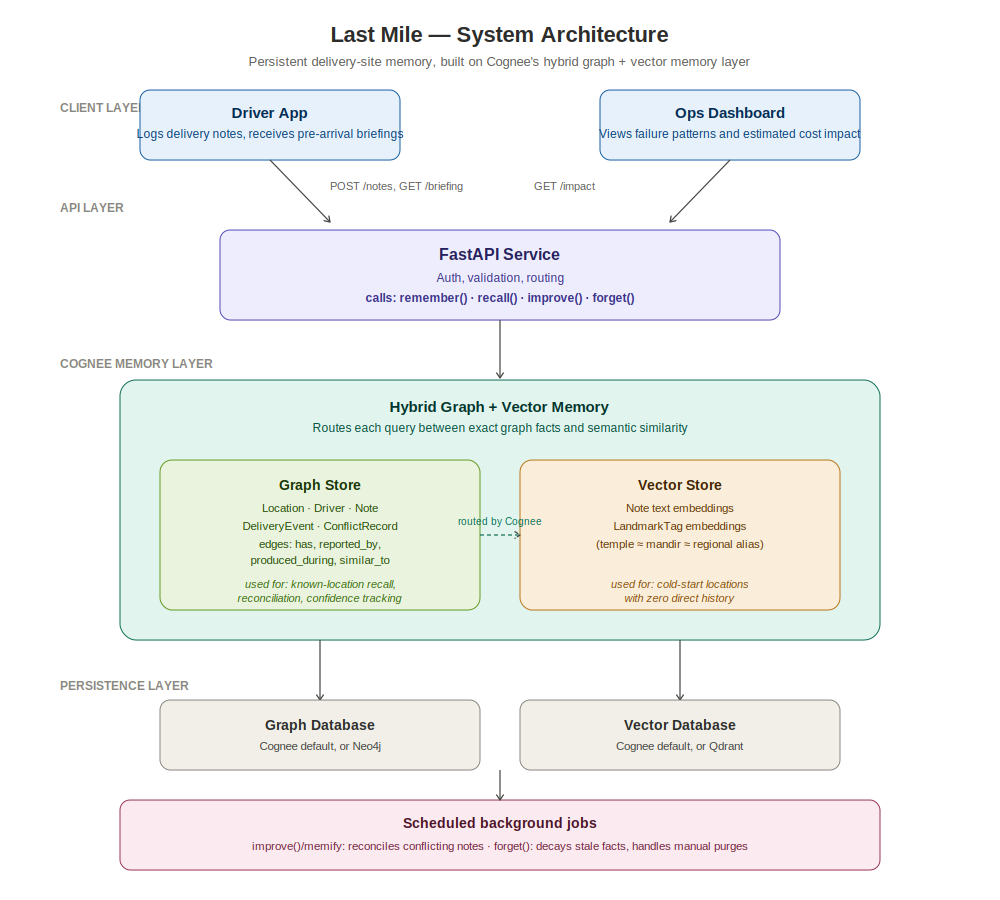

<div align="center">


# 📍 Last Mile
### The address remembers, even when the driver doesn't.

**Last Mile gives every delivery location a memory that survives driver turnover, missing pins, and confusing addresses.**

[](https://www.cognee.ai)
[](https://fastapi.tiangolo.com/)

[🎥 Demo Video](#) · [🚀 Live Demo](#)

</div>

---

## 😵 The Problem

In the city, the problem is knowing **which** Defence Colony, Sector 22 Area A, not Sector 22 Area B. Locality names repeat, sector numbers aren't intuitive, and a new driver ends up calling the customer just to get located.

In a small town or village, the problem is bigger: **there often is no formal address to get wrong.** Google Maps gets a driver to the general area, then it's word of mouth from there. "Near the temple." "Ask for Salim's house by Pasha's shop." "Behind the yellow house, past the tea stall." This knowledge is never written down anywhere. It lives in one driver's head, and it's gone the moment they quit, which in gig delivery happens constantly.

The result: repeat failed deliveries, damaged goods, and real cost to both drivers and customers, not just an annoying redelivery.

> 📊 Only around **40% of Indian addresses** resolve precisely on major mapping APIs, and it's worse outside big cities. A single added landmark can shrink an ambiguous search area from **76 sq. km down to 3 sq. km.**

---

## 💡 The Idea

Drivers leave a short note after every delivery. The next driver, whether it's their first day on the job or their five-hundredth, gets a synthesized briefing before they arrive: what's known about this spot, how sure we are, and where that knowledge came from.

**What one driver learns, every driver knows.**

---

## 🏗️ Architecture



---

## ✨ Features

- 📝 **Note capture** — drivers log what they learn in seconds, landmark or formal address
- 🔮 **Pre-arrival briefing** — a synthesized answer to "what should I know before I get there"
- 🧩 **Cold-start fallback** — no history yet? similarity across comparable locations fills the gap
- ⚖️ **Conflict reconciliation** — disagreeing reports get resolved, not just piled on top of each other
- 📉 **Confidence that builds and decays** — one report isn't the same as five confirmations, and stale facts fade out
- 🗣️ **Landmark & language aware matching** — "mandir" and "temple" point to the same thing
- 🗑️ **Privacy-respecting forget** — old or sensitive notes get purged, not hoarded

---

## 🧠 Why Cognee

This problem needs a **hybrid graph + vector memory**, not a plain database.

| API | Job it actually does |
|---|---|
| `remember()` | Structures every driver note into the graph: location, driver, note, and time, all connected |
| `recall()` | Routes between exact graph facts and vector similarity for locations with no direct history |
| `improve()` / memify | Reconciles conflicting reports and raises confidence as more drivers confirm the same thing |
| `forget()` | Ages out stale facts and supports manual privacy purges |

A pure vector search can't tell you a fact was just contradicted. A plain graph or SQL table can't generalize "near the temple" to a brand-new location it's never seen. This needs both working together, and that's the actual bet this project makes.

---

## 🌍 Why Now

India's quick-commerce and e-commerce platforms are pushing hard into Tier 2, 3, and 4 towns because the big cities are saturated. That's exactly where formal addressing breaks down the most, and exactly where this problem gets worse before it gets better. Rural internet users in India already outnumber urban ones. This isn't a shrinking niche, it's the direction the whole market is moving.

---

## 🛠️ Tech Stack

`Python` · `FastAPI` · `Cognee Cloud` · `[Streamlit]` 

## ⚡ Quick Start

```bash
git clone https://github.com/smilewithkhushi/last-mile.git
cd last-mile
cp .env.example .env        # then fill in your API keys
bash run.sh                 # creates venv, installs deps, starts everything
```

- **Backend API** → http://localhost:8000  
- **API docs** → http://localhost:8000/docs  
- **Driver & Ops UI** → http://localhost:8501  

Press `Ctrl+C` to stop both servers.

---

## 💰 Why This Could Be a Real Business

Failed first-attempt deliveries are a quiet, accepted cost across the industry, and almost every "AI for delivery" product out there is chasing routing, not memory. Last Mile is priced against the cost it removes and sold per-seat or per-delivery to regional couriers, quick-commerce platforms, and last-mile operators who feel this pain daily and can't build this kind of memory infrastructure themselves. The long-term moat: a fact learned once about a location helps every courier who delivers there, not just one company's drivers.


---

## 👥 Team

`Khushi` · `Palak`
